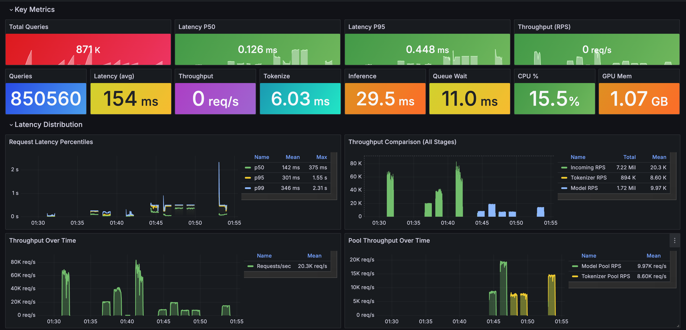
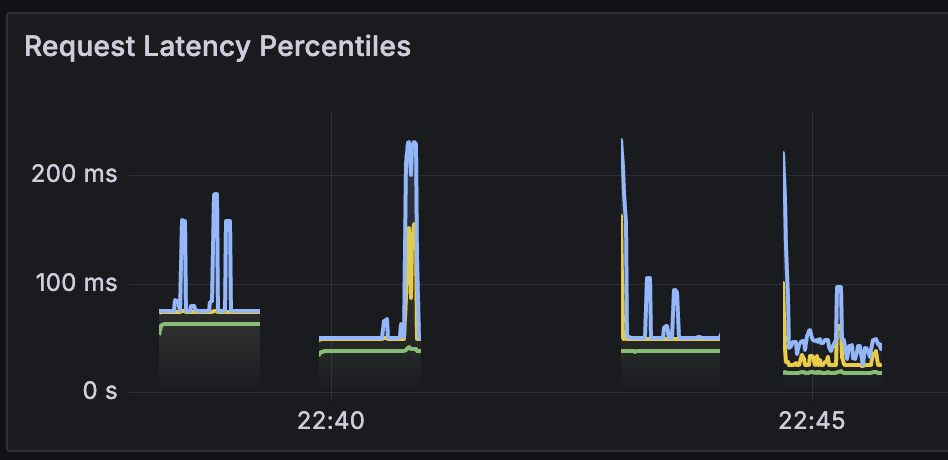
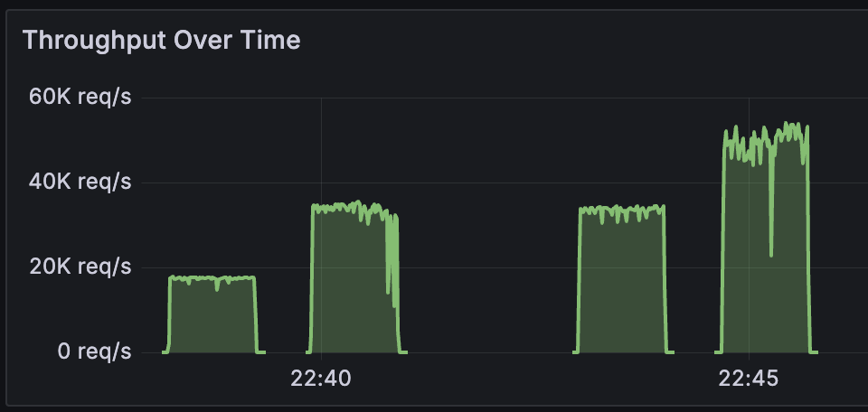

# Cross Encoder Inference Server

A high-performance ML inference server for cross-encoder models with support for multiple backends, quantization, and comprehensive benchmarking on Apple Silicon.




## Setup

### Prerequisites

- Python 3.11+
- macOS with Apple Silicon (for MPS backend) or Linux with CUDA (for GPU backend)
- Docker and Docker Compose (for observability stack)

### Installation

```bash
# Clone the repository
git clone <repository-url>
cd "cross encoder throughput experiments"

# Create and activate virtual environment
python3 -m venv venv
source venv/bin/activate

# Install dependencies
pip install -r requirements.txt
```

### Docker Setup (Observability Stack)

The project uses Docker for running Prometheus and Grafana (observability only). The inference server runs locally to leverage Apple Silicon hardware (MPS, MLX).

```bash
# Pull observability images
./scripts/setup_observability.sh

# Start observability services (Prometheus + Grafana)
./scripts/start_services.sh

# Stop all services and servers
./scripts/stop_all_servers.sh
```

## Configuration System

The project uses [Hydra](https://hydra.cc/) for configuration management. Configs are in `conf/`.

### Experiment Configuration

Experiments are defined in `conf/experiment/`:

```yaml
# @package _global_

defaults:
  - override /model_pool: default
  - override /batching: default
  - override /tokenizer_pool: default
  - override /server: default

name: "My Experiment"
description: "Description of experiment"

model_pool:
  instances:
    - name: "cross-encoder/ms-marco-MiniLM-L-6-v2"
      backend: mps          # pytorch, mps, mlx, compiled
      device: mps
      quantization: fp16    # fp32, fp16, int8, int4
      max_length: 512

batching:
  enabled: true
  max_batch_size: 32
  timeout_ms: 50.0

experiment:
  batch_sizes: [32, 64, 128]
  concurrency_levels: [1, 2, 4]
```


The sweep system automatically generates and runs all combinations.

## Running Experiments

### Quick Start

```bash
# 1. Start observability stack
./scripts/start_services.sh

# 2. Run a single experiment
./scripts/run_experiment.sh 10_multi_model_pool

# 3. View results
cat experiments/results/10_multi_model_pool_results.md

# 4. View dashboard
open http://localhost:3001

# 5. Running All Experiments
./scripts/run_all_experiments.sh
```

## Results and Analysis

### Throughput Benchmarks (MiniLM-L-6-v2, MPS, FP16, batch=128, concurrency=16)

| Configuration | Tokeniser Workers | Model Workers | Parallelism | RPS | Throughput (QPS) | Mean | P50 | P95 | P99 |
|---------------|-------------|---------------|-------------|-----|------------|------|-----|-----|-----|
| Tokenizer Only | 1 | - | off | 156 | ~20k | 101ms | 94ms | 225ms | 245ms |
| Tokenizer Only | 1 | - | on | 301 | ~38.5k | 52ms | 45ms | 78ms | 192ms |
| Tokenizer Only | 4 | - | on | 489 | ~62.5k | 32ms | 32ms | 56ms | 91ms |
| Inference Only | - | 1 | - | 64 | ~8.2k | 248ms | 201ms | 442ms | 489ms |
| Inference Only | - | 4 | - | 147 | ~18.9k | 150ms | 137ms | 406ms | 490ms |
| Full Pipeline | 1 | 1 | off | 57 | ~7.3k | 276ms | 360ms | 486ms | 497ms |
| Full Pipeline | 1 | 1 | on | 58 | ~7.4k | 274ms | 353ms | 485ms | 497ms |
| Full Pipeline | 2 | 4 | on | 111 | ~14.2k | 156ms | 91ms | 456ms | 501ms |

### Tokeniser Latency and Throughput

Latency decreases and throughput increases when enabling parallel tokenisation and tokeniser pool.






**Key Insights:**
- Tokenizer parallelism (`TOKENIZERS_PARALLELISM=true`) nearly doubles throughput (20k → 38.5k) and halves latency (94ms → 45ms p50)
- Tokenizer pool scaling: 4 workers achieves ~62.5k samples/sec with best latency (32ms p50, 91ms p99)
- Model inference is the bottleneck: single model worker has 201ms p50 vs 94ms for tokenizer
- Model pool scaling (4 workers): 2.3x throughput improvement (8.2k → 18.9k) with better p50 (201ms → 137ms)
- Full pipeline limited by model: parallelism alone has minimal impact on throughput or latency
- Scaling both pools (2 tok + 4 model) achieves 2x throughput with significantly better p50 (360ms → 91ms)


## License

MIT
