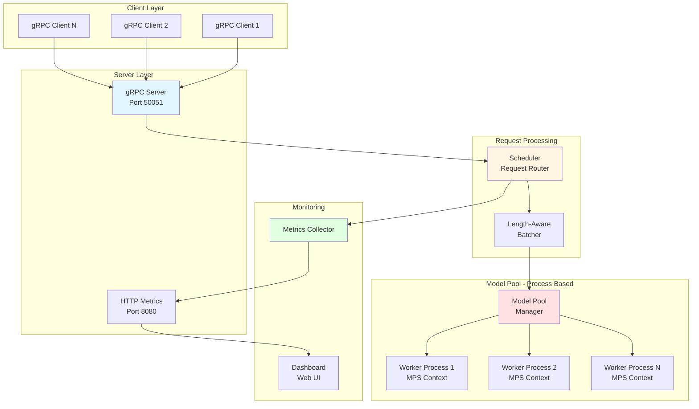
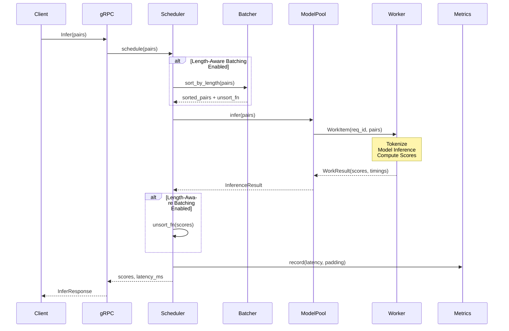
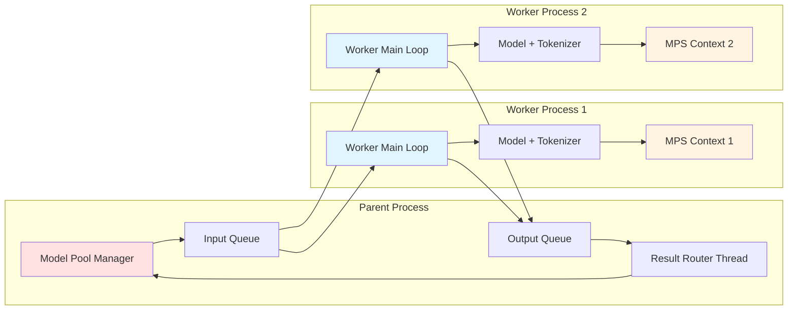
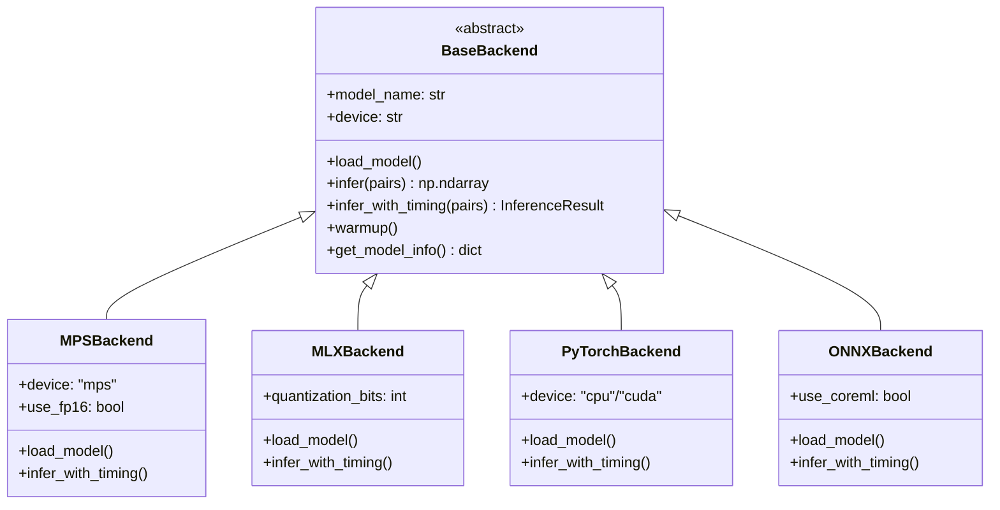
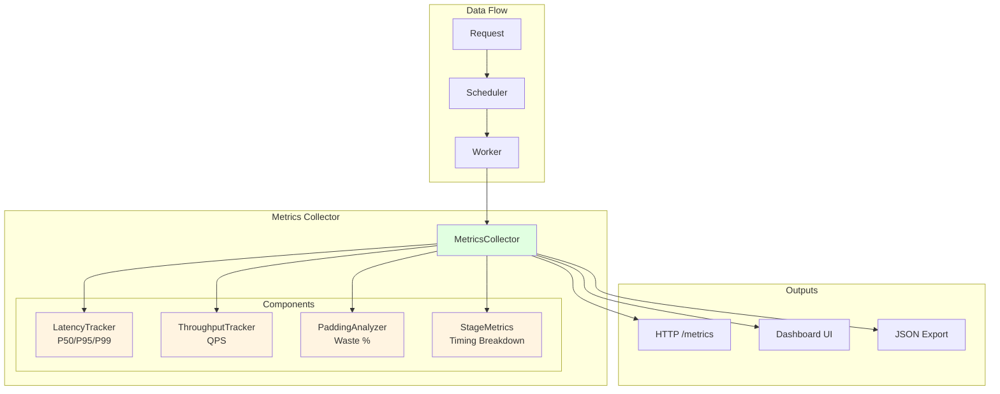

# ML Inference Server - Architecture Documentation

## Overview

A high-performance gRPC-based inference server for cross-encoder models (e.g., sentence similarity, reranking) with support for:
- **Dynamic batching** for improved throughput
- **Multi-backend support** (PyTorch MPS, MLX, ONNX)
- **Process-based parallelism** for Apple Silicon (MPS)
- **Real-time metrics** dashboard
- **Length-aware batching** to reduce padding waste

---

## High-Level Design (HLD)

### System Architecture



### Component Responsibilities

| Component | Responsibility | Key Features |
|-----------|---------------|--------------|
| **gRPC Server** | Accept client requests | Thread pool, async handling |
| **Scheduler** | Route requests to workers | Load balancing, timing |
| **Length-Aware Batcher** | Sort pairs by length | Reduce padding waste |
| **Model Pool** | Manage worker processes | True parallelism on MPS |
| **Worker Process** | Run model inference | Isolated MPS context |
| **Metrics Collector** | Track performance | Latency, throughput, padding |
| **HTTP Server** | Serve metrics/dashboard | Real-time monitoring |

---

## Low-Level Design (LLD)

### Request Flow



### Model Pool Architecture (Process-Based)



**Why Process-Based?**
- Apple Silicon (MPS) has **Metal command buffer conflicts** with thread-based concurrency
- Each process gets its own **isolated MPS context** → true parallelism
- Parent process **never imports torch** → workers initialize independently

### Backend Architecture



### Metrics System



---

## Data Structures

### InferenceResult

```python
@dataclass
class InferenceResult:
    scores: np.ndarray              # Relevance scores
    t_tokenize_ms: float           # Tokenization time
    t_model_inference_ms: float    # Model forward pass time
    total_ms: float                # Total latency

    # Padding analysis
    total_tokens: int              # Total tokens (with padding)
    real_tokens: int               # Actual content tokens
    padded_tokens: int             # Padding tokens
    padding_ratio: float           # Waste ratio (0-1)
    max_seq_length: int            # Longest sequence
    avg_seq_length: float          # Average sequence length
    batch_size: int                # Number of pairs
```

### WorkItem / WorkResult (IPC)

```python
@dataclass
class WorkItem:
    req_id: int                    # Unique request ID
    pairs: List[Tuple[str, str]]   # Query-document pairs

@dataclass
class WorkResult:
    req_id: int                    # Matches WorkItem
    scores: np.ndarray             # Results
    worker_id: int                 # Which worker processed it
    # + all InferenceResult fields
```

---

## Configuration

### Production Config (Optimized)

Based on experiment results, the optimal production configuration is:

```yaml
model:
  name: "cross-encoder/ms-marco-MiniLM-L-6-v2"
  device: "mps"
  backend: "mps"  # or "mlx" - similar performance
  max_length: 256

batching:
  enabled: true
  max_batch_size: 64      # Optimal for throughput/latency
  timeout_ms: 20          # Low timeout for responsiveness

scheduler:
  enable_length_aware_batching: true  # Reduce padding waste

server:
  host: "0.0.0.0"
  port: 50051
  grpc_workers: 10

# Expected Performance:
# - Throughput: ~720 pairs/sec
# - Latency P50: ~176ms
# - Latency P99: ~211ms
```

---

## Performance Characteristics

### Throughput vs Latency Trade-offs

| Config | Throughput | Latency (P50) | Latency (P99) | Use Case |
|--------|-----------|---------------|---------------|----------|
| batch=32, conc=1 | 519 p/s | 92ms | 165ms | **Latency-sensitive** |
| batch=64, conc=2 | **719 p/s** | 178ms | 211ms | **Balanced (BEST)** |
| batch=96, conc=3 | 776 p/s | 369ms | 447ms | **High throughput** |

### Optimization Impact

| Optimization | Improvement | Notes |
|--------------|-------------|-------|
| Dynamic Batching | +35% throughput | Aggregates small requests |
| Length-Aware Batching | -25% latency | Reduces padding waste |
| FP16 Precision | +10-12% throughput | MPS/MLX only |
| Process-Based Pool | True parallelism | Required for MPS |

---

## Key Design Decisions

### 1. Why Process-Based (not Thread-Based)?

**Problem:** Apple Silicon's Metal framework has command buffer conflicts with multi-threading.

**Solution:** Each worker runs in a separate process with its own MPS context.

```python
# ❌ BAD: Thread-based (causes Metal conflicts)
with ThreadPoolExecutor(max_workers=4) as executor:
    futures = [executor.submit(model.predict, batch) for batch in batches]

# ✅ GOOD: Process-based (isolated MPS contexts)
workers = [Process(target=worker_main, args=(queue,)) for _ in range(4)]
```

### 2. Why Length-Aware Batching?

**Problem:** Padding waste - short sequences padded to max length waste compute.

**Example:**
```
Batch: ["hi", "hello world", "this is a much longer sentence"]
Without sorting: pad all to 10 tokens → 70% waste
With sorting:    pad similar lengths → 30% waste
```

**Solution:** Sort pairs by estimated length before batching, unsort scores after.

### 3. Why Separate Metrics Components?

**Modularity:** Each component (latency, throughput, padding) is independent and testable.

```python
# Composed metrics collector
metrics = MetricsCollector(
    latency=LatencyTracker(),
    throughput=ThroughputTracker(),
    padding=PaddingAnalyzer(),
    stages=StageMetricsGroup(),
)
```

---

## API Reference

### gRPC Service

```protobuf
service InferenceService {
  rpc Infer (InferRequest) returns (InferResponse);
  rpc GetMetrics (Empty) returns (MetricsResponse);
}

message InferRequest {
  repeated QueryDocPair pairs = 1;
}

message InferResponse {
  repeated float scores = 1;
  int32 num_pairs = 2;
  float latency_ms = 3;
}
```

### Python Client

```python
from ml_inference_server.client import InferenceClient

client = InferenceClient("localhost:50051")

pairs = [
    ("query 1", "document 1"),
    ("query 2", "document 2"),
]

scores = client.infer(pairs)
print(f"Scores: {scores}")
```

---

## Monitoring & Observability

### Metrics Dashboard

Access at: `http://localhost:8080`

**Key Metrics:**
- **Latency Distribution:** P50, P95, P99 percentiles
- **Throughput:** Requests/sec, Pairs/sec
- **Padding Waste:** % of tokens that are padding
- **Stage Breakdown:** Tokenization vs Model Inference time
- **Per-Instance Metrics:** Load distribution across workers

### JSON Metrics Endpoint

```bash
curl http://localhost:8080/metrics
```

```json
{
  "count": 1000,
  "avg_ms": 178.5,
  "p50_ms": 176.2,
  "p95_ms": 201.3,
  "p99_ms": 211.4,
  "throughput_qps": 719.2,
  "padding_ratio": 0.32,
  "stage_breakdown": {
    "tokenize_ms": 12.3,
    "inference_ms": 165.1
  }
}
```

---

## Deployment

### Production Checklist

- [ ] Use **batch=64, concurrency=2** for balanced performance
- [ ] Enable **length-aware batching** to reduce padding
- [ ] Set **timeout_ms=20** for low latency
- [ ] Monitor **P99 latency** to catch tail latency issues
- [ ] Use **FP16** on MPS/MLX for 10-12% speedup
- [ ] Set **max_length=256** to prevent OOM on long inputs
- [ ] Configure **grpc_workers=10** for concurrent client handling

### Resource Requirements

| Configuration | CPU | Memory | GPU Memory | Throughput |
|---------------|-----|--------|------------|------------|
| Single Worker | 2 cores | 2GB | 1GB | ~520 p/s |
| 2 Workers | 4 cores | 4GB | 2GB | ~720 p/s |
| 3 Workers | 6 cores | 6GB | 3GB | ~780 p/s |

---

## Troubleshooting

### Common Issues

**1. "Socket closed" / Connection refused**
- **Cause:** MPS instability with high concurrency
- **Fix:** Reduce `concurrency_levels` to 1-2

**2. High padding waste (>50%)**
- **Cause:** Mixed sequence lengths in batch
- **Fix:** Enable `enable_length_aware_batching: true`

**3. Low throughput (<500 p/s)**
- **Cause:** Batch size too small or timeout too short
- **Fix:** Increase `max_batch_size` to 64 and `timeout_ms` to 20

**4. High P99 latency (>500ms)**
- **Cause:** Too many concurrent requests queuing
- **Fix:** Add more workers or reduce concurrency

---

## Future Improvements

1. **Adaptive Batching:** Dynamically adjust batch size based on load
2. **Request Prioritization:** High-priority requests skip queue
3. **Model Caching:** Cache embeddings for repeated queries
4. **Distributed Inference:** Multi-machine deployment
5. **Auto-scaling:** Spawn/kill workers based on load

---

## References

- **Experiment Results:** `docs/experiments/all_results.md`
- **Best Config:** Experiment 08a (batch=64, conc=2, dynamic batching)
- **Performance Analysis:** `docs/experiments/systematic_experiment_summary.md`
- **Code:** `ml_inference_server/`
