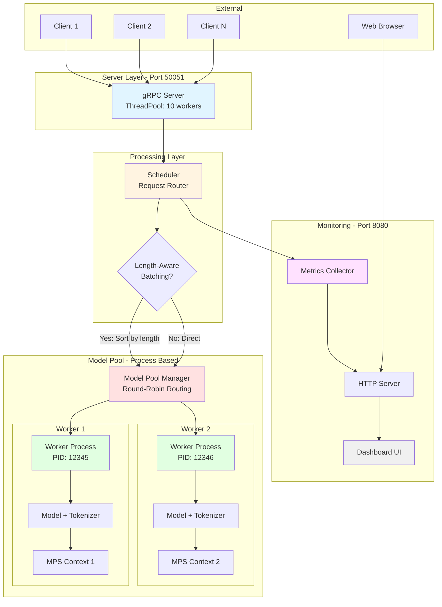
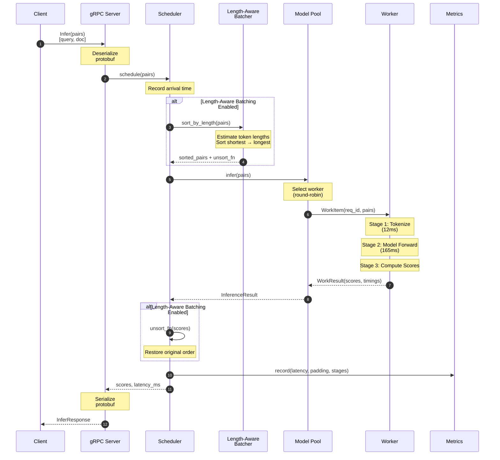
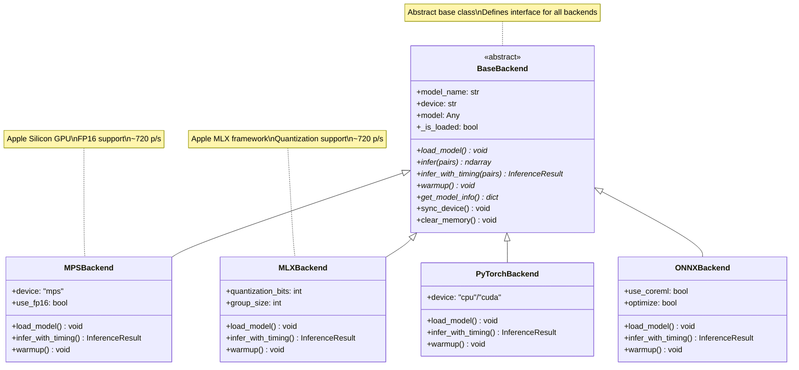
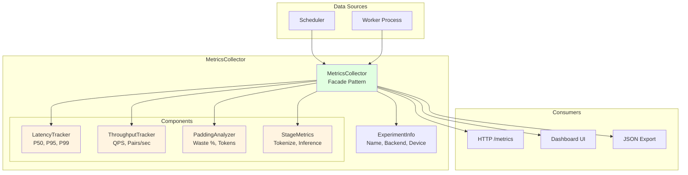
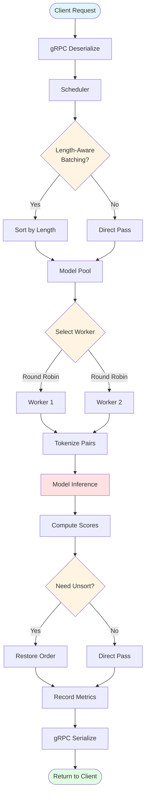
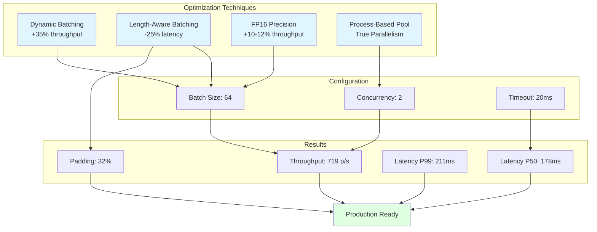
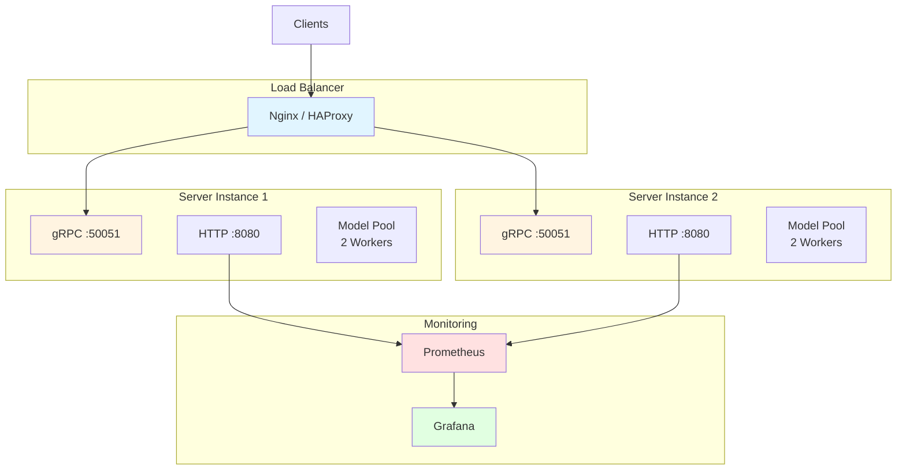
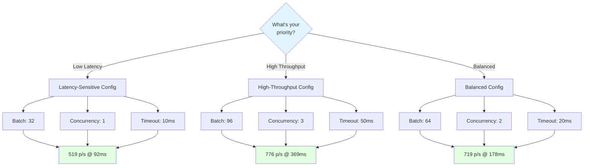

# Visual Architecture Summary

## System Overview



---

## Request Flow (Detailed)



---

## Model Pool Architecture

```mermaid
graph LR
    subgraph "Parent Process"
        direction TB
        MP[Model Pool Manager]
        IQ[Input Queue<br/>multiprocessing.Queue]
        OQ[Output Queue<br/>multiprocessing.Queue]
        RT[Result Router<br/>Background Thread]
        FUTURES[Pending Requests<br/>Dict[req_id → Future]]
    end

    subgraph "Worker Process 1 - PID 12345"
        direction TB
        W1[Worker Main Loop]
        M1[CrossEncoder Model]
        T1[Tokenizer]
        MPS1[MPS Context 1<br/>Isolated Metal]
    end

    subgraph "Worker Process 2 - PID 12346"
        direction TB
        W2[Worker Main Loop]
        M2[CrossEncoder Model]
        T2[Tokenizer]
        MPS2[MPS Context 2<br/>Isolated Metal]
    end

    MP --> IQ
    IQ --> W1
    IQ --> W2

    W1 --> M1
    W1 --> T1
    M1 --> MPS1

    W2 --> M2
    W2 --> T2
    M2 --> MPS2

    W1 --> OQ
    W2 --> OQ
    OQ --> RT
    RT --> FUTURES
    FUTURES --> MP

    style MP fill:#ffe1e1
    style IQ fill:#fff4e1
    style OQ fill:#fff4e1
    style W1 fill:#e1f5ff
    style W2 fill:#e1f5ff
    style MPS1 fill:#e1ffe1
    style MPS2 fill:#e1ffe1
```

---

## Backend Class Hierarchy



---

## Metrics System Composition



---

## Data Flow Diagram



---

## Performance Optimization Flow



---

## Deployment Architecture



---

## Configuration Decision Tree



---

## Summary

This visual guide provides:

1. **System Overview** - High-level architecture
2. **Request Flow** - Detailed sequence diagram
3. **Model Pool** - Process-based parallelism
4. **Backend Hierarchy** - Class structure
5. **Metrics System** - Component composition
6. **Data Flow** - Request processing pipeline
7. **Performance Optimization** - Techniques and results
8. **Deployment** - Production architecture
9. **Configuration** - Decision tree for config selection

**Key Takeaway:** The system uses process-based parallelism for true concurrent inference on Apple Silicon, with dynamic and length-aware batching for optimal performance (719 p/s @ 178ms latency).
